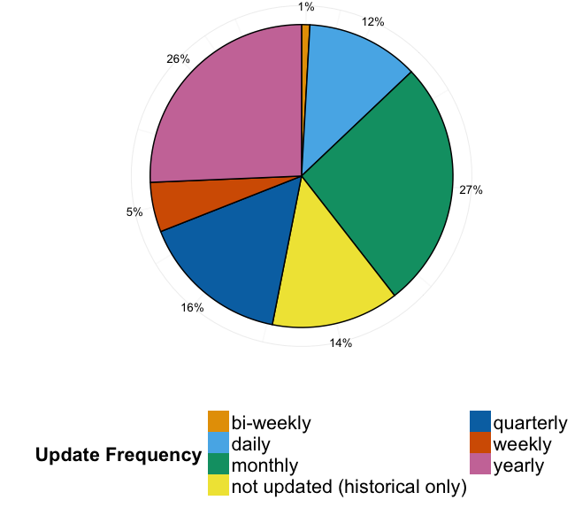

# Inventory Findings
The data inventory we have compiled is the first data inventory in the history of the City.  Needless to say, it is a living document and will continue to evolve.  Since this first-ever inventory is human generated, it will require cleaning as there are a number of values that do not fit into the validation criteria (for example: a coordinator putting "publicly available" instead of "public" in the data classification field).  In addition, we still need to validate and merge information from non-human sources.  Finally, before release, we must mitigate for data that may expose personally identifiable information or cybersecurity vulnerabilities.  After we have verified the inventory data (we expect to finish this by September 2015), we will post a list of public data sets for public review and update this analysis.

## Submissions By Department
Below is a list of submissions by department.  Departments vary in size, number of employees, budget, and nature of workload, so we expected a wide diversity in these figures. They do not indicate the quality of any department's participation in the process.  As we proceed with the program, the inventory will become more robust and these numbers will grow more accurate.

### Overall Submissions By Department
####Submission Counts 

|dept                                         | numDatasets|
|:--------------------------------------------|-----------:|
|ada compliance and accessibility (office of) |           8|
|city auditor                                 |           6|
|city clerk                                   |          30|
|city comptroller                             |          93|
|city treasurer                               |          63|
|commission for arts and culture              |          27|
|communications                               |           4|
|corporate partnerships and development       |           6|
|debt management                              |          64|
|development services                         |          24|
|docket                                       |           2|
|doit                                         |         247|
|economic development                         |          11|
|environmental services                       |         112|
|ethics commission                            |           1|
|financial management                         |          31|
|fire-rescue department                       |          24|
|homeland security                            |          11|
|human resources                              |          22|
|library                                      |          38|
|park and recreation                          |         221|
|performance & analytics                      |           8|
|personnel                                    |           3|
|planning department                          |          16|
|police                                       |          12|
|public utilities                             |         749|
|public works / ecp                           |           8|
|purchasing & contracting                     |          17|
|read                                         |          14|
|risk management                              |          42|
|special events                               |          17|
|transportation & storm water                 |          99|
|**Total**                                    |    **2030**|

 

#### Insights
The City has a substantial amount of data, and information coordinators worked hard to educate Performance and Analytics about the data.  

## Public Dataset Analysis
As part of the inventory process, departments were asked to identify datasets they consider to be already public, and if they are already publishing them.  Although this information is preliminary and still needs to be validated, below is a general overview of department-reported information about public datasets.

### Public Datasets Per Department

 

#### Insights
As seen above, there is quite a bit of data that departments already consider to be public, but are not yet publishing.  As we prioritize public data sets for release, we envision these to be the low hanging fruit that would likely be first in line to flow into the portal.  Some examples include: 
* Capital Improvement Projects (PW).
* Library Locations and Hours (Library).
* Event Calendars (Parks).
* Business Tax Data (Treasurer).

### Update Frequency
As a result of the inventory process, we also obtained a general overview of how frequently departments update datasets.  Although this information has yet to be verified, dataset update frequency offers another criteria we will consider when identifying public datasets for release.  Uploading datasets to the portal that are frequently updated would require automated processes that may or may not require additional resources.

#### Public Datasets Update cycles.
 

#### Insight
Public datasets updated less frequently represent other low-hanging fruit, because they may not warrant a need for an automated process to publish data that might require additional resources.  Examples of datasets already published, with low change frequency:
* Fire Hydrants (PUD)
* Storm Water Runoff Report (TSW)
* Business Improvement Districts (Economic Development)
* Rec Spaces (Park and Rec) 
* Fire Stations (Fire Department)
* Annual Permit Issuances (DSD)
