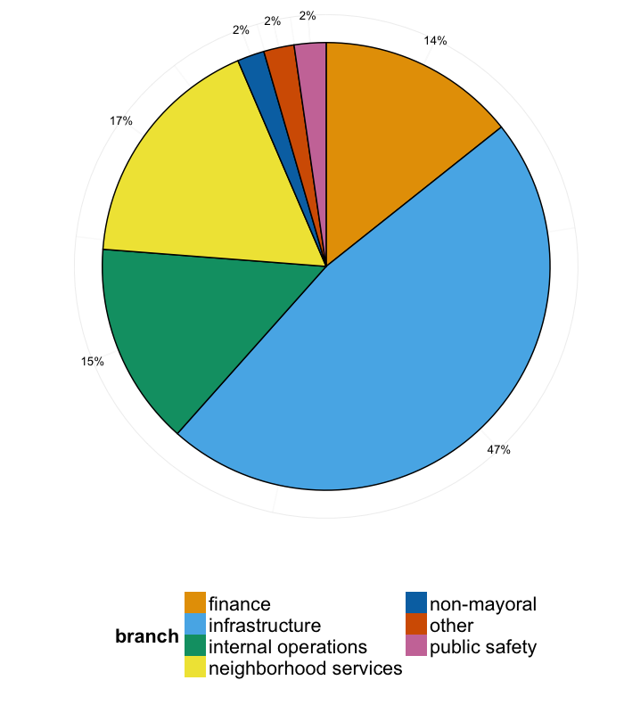
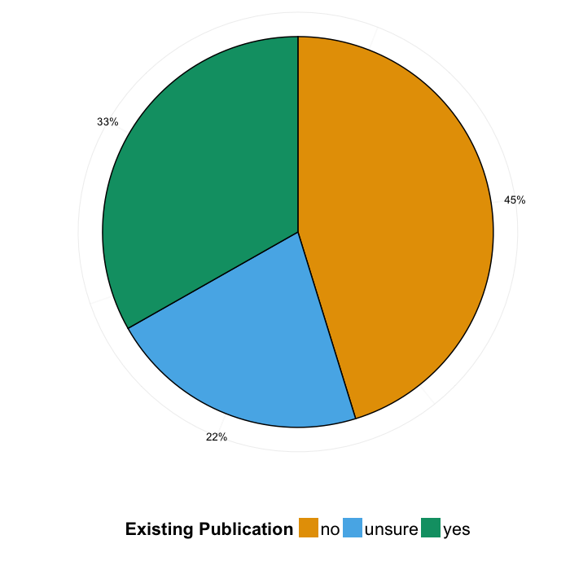

# Inventory Findings
The Data Inventory we compiled is the first Data Inventory in the history of the City.  Needless to say, it is a living document and will continue to evolve.  Since this first ever inventory is human generated, it will require cleaning, as there are a number of values that do not fit into the validation criteria (for example: a coordinator inputting "publicly available" instead of "public" in the data classification field).  In addition, we still need to validate and merge information from non-human sources.  Finally, before release, we must mitigate for data that may expose PII or cybersecurity vulnerabilities.  After we have verified the inventory data, we will post a list of datasets for public review.

## Submissions By Department
Below is a list of submissions by department.  Departments vary in size, number of employees, budget, and nature of workload, so we expected a wide diversity in these figures. They do not indicate the quality of any department's participation in the process.  As we proceed with the program, the inventory will become more robust and these numbers will grow more accurate. 

##### Submissions Per Department

|dept                                           | numDatasets|
|:----------------------------------------------|-----------:|
|ada compliance and accessibility (office of)   |           8|
|citizens' review board on police practices     |           9|
|city auditor                                   |           6|
|city clerk                                     |          30|
|city comptroller                               |          93|
|city treasurer                                 |          63|
|commission for arts and culture                |          27|
|commission on gang prevention and intervention |           3|
|communications                                 |           4|
|corporate partnerships and development         |           6|
|debt management                                |          64|
|development services                           |          24|
|docket                                         |           2|
|doit                                           |         247|
|economic development                           |          11|
|environmental services                         |         112|
|ethics commission                              |           1|
|financial management                           |          31|
|fire-rescue department                         |          24|
|homeland security                              |          11|
|human relations commission                     |           6|
|human resources                                |          22|
|library                                        |          38|
|park and recreation                            |         221|
|performance & analytics                        |           8|
|personnel                                      |           3|
|planning department                            |          16|
|police                                         |          12|
|public utilities                               |         749|
|public works / ecp                             |           8|
|purchasing & contracting                       |          17|
|read                                           |          14|
|risk management                                |          42|
|special events                                 |          17|
|transportation & storm water                   |          99|
|**Total**                                      |    **2048**|

##### Submissions By Branch
 

##### Insights
The City has a substantial amount of data, and information coordinators worked hard to educate Performance and Analytics about the data.  

## Public Dataset Analysis
As part of the inventory process, we asked departments to identify datasets they consider to be already public, and if they are already publishing them.  Because this information is preliminary and still needs to be validated, below is a general citywide aggregated overview of department-reported information about public datasets.

##### Citywide Publication of Reported Public Datasets 

##### Insights
Departments already consider nearly half of the reported datasets to be public but are not yet publishing them. As we prioritize public datasets for release, we envision these to be among the low-hanging fruit to consider for publication in the Open Data portal.  Some examples include:
* Capital Improvement Projects (PW).
* Library Locations and Hours (Library).
* Event Calendars (Parks & Special Events).
* Business Tax Data (Treasurer).

## Update Frequency
As a result of the inventory process, we also obtained a general overview of how frequently departments update datasets.  Although this information has yet to be verified (and thus is presented in aggregated form below), dataset update frequency offers another criteria we will consider when identifying public datasets for release.  Uploading datasets to the portal that are frequently updated would require automated processes that may require additional resources.

##### Frequency of Updates of Reported Public Datasets
 

##### Insights
Public datasets updated less frequently represent other low-hanging fruit, because they may not warrant a need for an automated process to publish data.  Examples of datasets already published, with low update frequency:
* Fire Hydrants (PUD)
* Storm Water Runoff Report (TSW)
* Business Improvement Districts (Economic Development)
* Rec Spaces (Park and Rec) 
* Fire Stations (Fire Department)
* Annual Permit Issuances (DSD)
